# 关于深度学习的一些基础知识

本文仅会使用Python来从零实现诸如误差反向传播、卷积运算等技术，便于从实现层面上理解深度学习。

内容来自[《深度学习入门：基于Python的理论和实现》[日] 斋藤康毅](https://www.ituring.com.cn/book/1921)，推荐有时间的读者阅读，本文相当于是这本书的简化版，部分代码与书中不同，注意区别。

---

## NumPy与矩阵运算

#### 算术运算

```python
>>>import numpy as np
>>>x = np.array([[1, 2, 3], [4, 5, 6]])
>>>print(x)
[[1 2 3]
 [4 5 6]]
>>>x.shape
(2, 3) # 行，列
>>>y = np.array([[1], [2], [3]])
>>>y.shape
(3, 1)
>>>print(np.dot(x, y))
[[14]
 [32]]
```

即点乘${\large \begin{bmatrix}1&2&3\\4&5&6\end{bmatrix}\cdot\begin{bmatrix}1\\2\\3\end{bmatrix}=\begin{bmatrix}14\\32\end{bmatrix}}$

对于下列方程组
$$
{\large\begin{cases}y_{1}=w_{11}x_{1}+w_{12}x_{2}+w_{13}x_{3}+b_{1}\\y_{2}=w_{21}x_{1}+w_{22}x_{2}+w_{23}x_{3}+b_{2}\end{cases}}
$$
用矩阵可以表示为
$$
{\large Y=XW^{T}+B}
$$
  其中
$$
{\large Y=\begin{bmatrix}y_{1}&y_{2}\end{bmatrix},X=\begin{bmatrix}x_{1}&x_{2}&x_{3}\end{bmatrix},W=\begin{bmatrix}w_{11}&w_{12}&w_{13}\\w_{21}&w_{22}&w_{23}\end{bmatrix},B=\begin{bmatrix}b_{1}&b_{2}\end{bmatrix}}
$$
代码实现如下

```python
>>>X = np.array([1.0, 0.5, 0.6])
>>>W = np.array([[0.1, 0.3, 0.5], [0.2, 0.4, 0.6]])
>>>B = np.array([0.1, 0.2])
>>>X.shape
(2,)
>>>W.shape
(2, 3)
>>>B.shape
(3,)
>>>Y = np.dot(X, W.T) + B
>>>print(Y)
[0.65 0.96]
```

#### *NumPy的广播

NumPy中形状不同的数组也可以运算。例如对于${\large \begin{pmatrix}1&2\\3&4\end{pmatrix}\times10=\begin{pmatrix}10&20\\30&40\end{pmatrix}}$，NumPy的实现如图。

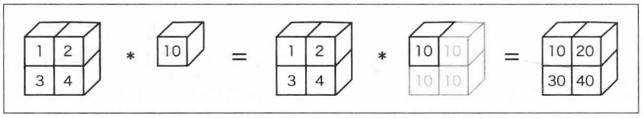

```python
>>>A = np.array([[1, 2], [3, 4]])
>>>B = np.array([10, 20])
>>>A * B
array([[10, 40],
       [30, 80]])
```

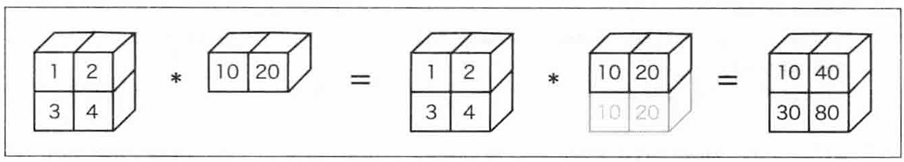

*需要注意的是这里的 \* 和矩阵点乘不是同一回事*

---

## 感知机（Perceptron）

#### 什么是感知机

感知机接收多个信号，输出一个信号，信号只有“0”和“1”两种。也可以被称为“人工神经元”。

如图示，传入$x_1$和$x_2$，分别乘**权重**$w_1$和$w_2$，神经元会计算总和，当总和超过设定好的**阈值**时输出“1”，否则输出“0”。

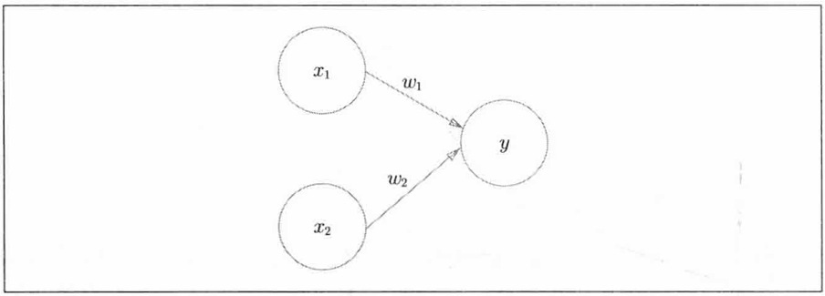

数学表达式如下：
$$
\large y=\begin{cases}0&\left(w_{1}x_{1}+w_{2}x_{2}\leq \theta \right)\\1&\left(w_{1}x_{1}+w_{2}x_{2}>\theta \right)\end{cases}
$$
其中$\theta$为阈值。或者使用另一种以后更常用的表达式：
$$
\large y=\begin{cases}0&\left(w_{1}x_{1}+w_{2}x_{2}+b\leq 0 \right)\\1&\left(w_{1}x_{1}+w_{2}x_{2}+b>0 \right)\end{cases}
$$
其中$b$为**偏置**。代码实现如下（输入为矩阵）：

```python
def perceptron(X, W, b):  #(X: np.array[float], W: np.array[float], b: float) -> int:
    tmp = np.sum(np.dot(X, W.T)) + b
    if tmp <= 0:
        return 0
    else:
        return 1
```

#### 感知机的局限

事实上，对于二维输入的感知机，相当于在由$x_1$和$x_2$两个坐标轴张成的平面空间中画一条线，线以上的空间输出均为1，线以下的空间输出均为0。

可以使用感知机来表示与门、与非门、或门等逻辑结构，此处不做演示。但是，感知机无法表示异或门。

如图所示，直线方程为$w_{1}x_{1}+w_{2}x_{2}+b=0$，而对于异或门来说，(1,1)和(0,0)的输出为0（图中表示为◯），(0,1)和(1,0)的输出为1（图中表示为$\triangle$），可以发现，无论怎么调整这条直线，都无法将◯和$\triangle$各自分开在两个空间中，所以单个感知机无法实现异或门。

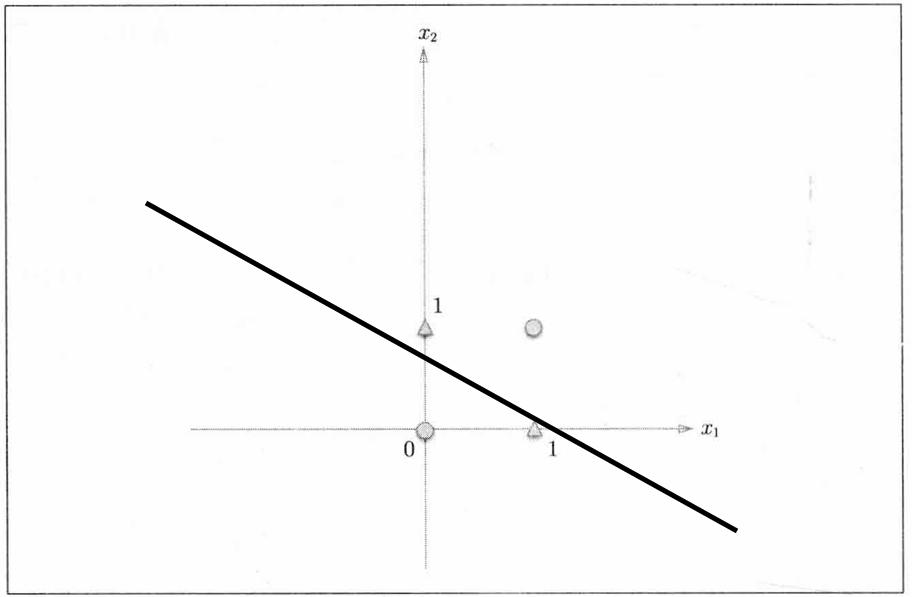

*这种由直线分割的空间被称为**线性**空间，如果上图不使用直线而使用曲线，那就可以将◯和$\triangle$分开了，这样分割的空间被称为**非线性**空间。*

#### 多层感知机（MLP, Multilayer Perceptron）

感知机是可以叠加的。

多层感知机可以表示异或门，此处不做演示。这意味着多层感知机可以做到更多的事情。

------

## 神经网络（Neural Network）

神经网络的本质就是一个复杂一点的函数。神经网络的连接方式和多层感知机没有任何差异，结构如图示：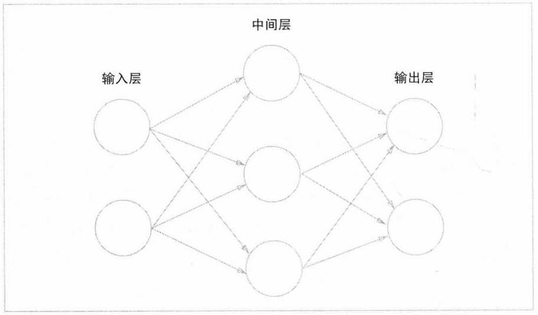

最左端称为**输入层**， 最右端称为**输出层**， 中间的称为**中间层**，也叫**隐藏层**。

#### 激活函数（Activation Function）

下面是一个感知机的表达式
$$
\large y=\begin{cases}0&\left(w_{1}x_{1}+w_{2}x_{2}+b\leq 0 \right)\\1&\left(w_{1}x_{1}+w_{2}x_{2}+b>0 \right)\end{cases}
$$
可以将其改写为
$$
{\large y=h(w_1x_1+w_2x_2+b)}
$$

$$
\large h(x)=\begin{cases}0&\left(x\leq 0 \right)\\1&\left(x>0 \right)\end{cases}
$$

上面表达式中的$h(x)$函数被称为**阶跃函数**。

可以发现$h(x)$函数会将输入的总和信号转换为输出信号，这种函数一般被称为**激活函数**。

神经网络中使用的一个激活函数是**sigmoid函数**。
$$
\large h(x)=\frac{1}{1+e^{-x}}
$$
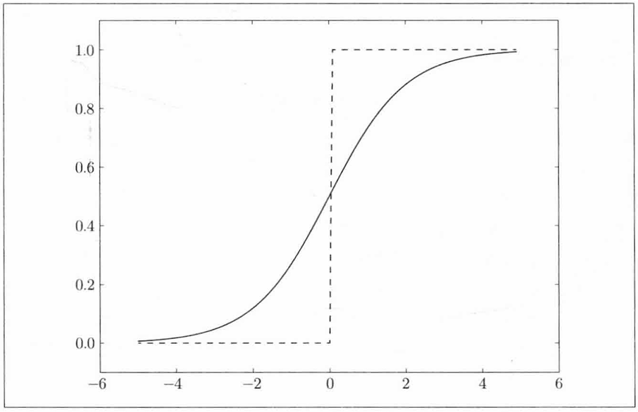

*实线是sigmoid函数，虚线是阶跃函数。*

sigmoid函数与阶跃函数均为**非线性函数**（输入值是输出值的常数倍），神经网络的激活函数必须使用非线性函数，否则加深神经网络的层数就没有意义了。

sigmoid函数相对与阶跃函数具有平滑性， 这对神经网络的学习有着重要意义。

还有一种激活函数是**ReLU(Rectified Linear Unit)函数**，表达式如下
$$
\large h(x)=\begin{cases}0&\left(x \leq0 \right)\\x&\left(x>0 \right)\end{cases}
$$
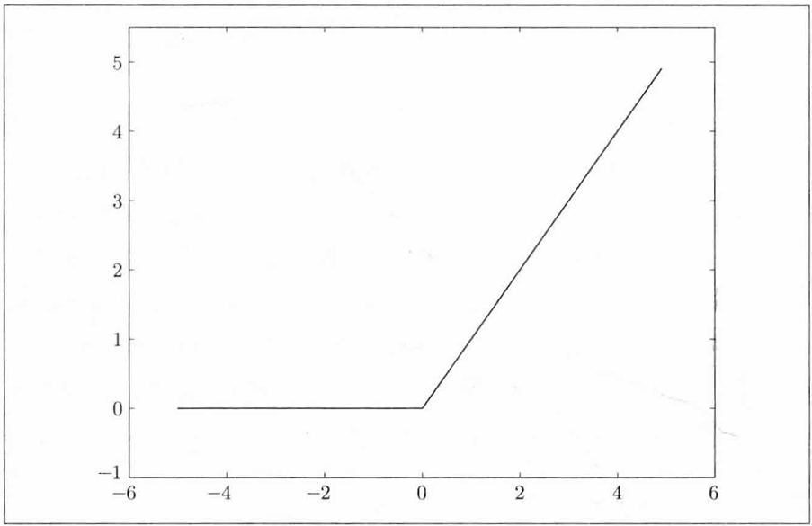

以下是三个激活函数的Python实现

```python
def step_func(x):
    y = x > 0
    return y.astype(np.int)

def sigmoid(x):
    return 1 / (1 + np.exp(-x))

def ReLU(x):
    return np.maxinum(0, x)
```

#### 三层神经网络的实现

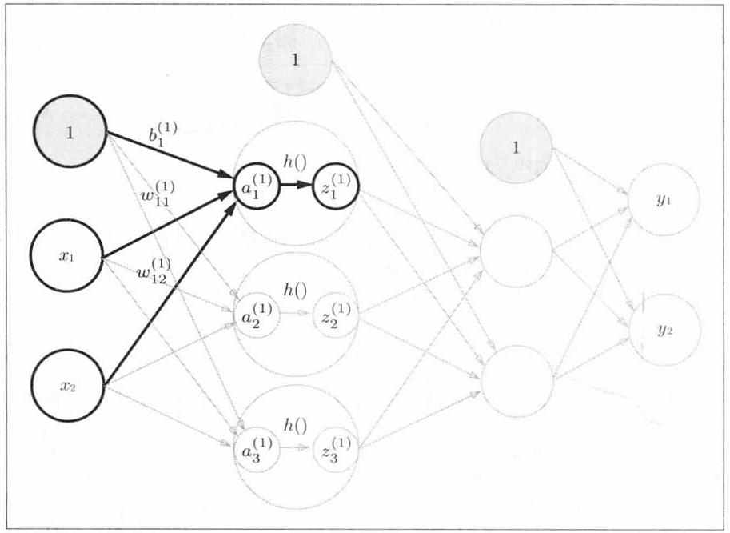

第一层的实现
$$
{\large A_1=XW^{T}_1+B_1}
$$
其中
$$
{\large A_1=\begin{bmatrix}a_{1}^{(1)}&a_{2}^{(1)}&a_{3}^{(1)}\end{bmatrix},X=\begin{bmatrix}x_{1}&x_{2}\end{bmatrix},W_1=\begin{bmatrix}w_{11}^{(1)}&w_{12}^{(1)}\\w_{21}^{(1)}&w_{22}^{(1)}\\w_{31}^{(1)}&w_{32}^{(1)}\end{bmatrix},B_1=\begin{bmatrix}b_{1}^{(1)}&b_{2}^{(1)}&b_{3}^{(1)}\end{bmatrix}}
$$
代码实现如下

```python
X = np.array([1.0, 0.5])
# 真实的神经网络的权重和偏置初始为随机值。
W1 = np.array([[0.1, 0.2],
               [0.3, 0.4],
               [0.5, 0.6]])
B1 = np.array([0.1, 0.2, 0.3])

A1 = np.dot(X, W1.T) + B1
Z1 = sigmoid(A1) # 激活函数h()

print(A1) # [0.3 0.7 1.1]
print(Z1) # [0.57444252 0.66818777 0.75026011]
```

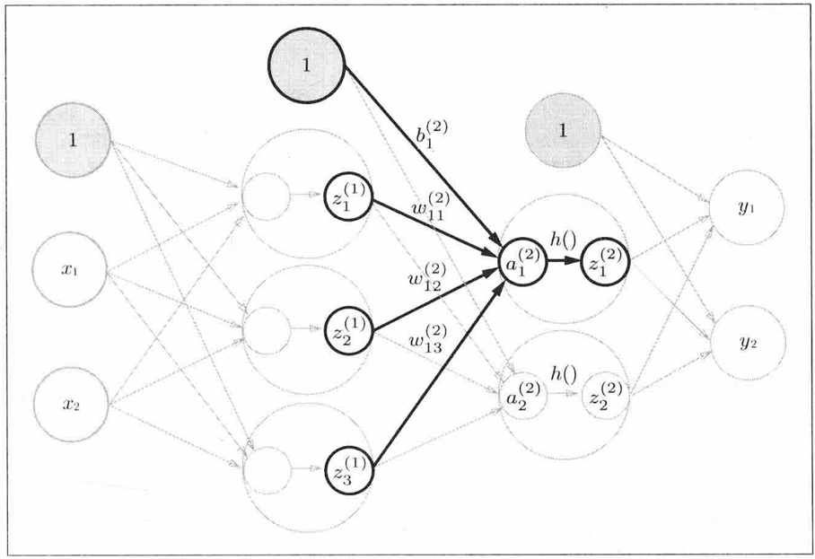

第二层的实现也类似
$$
{\large A_2=Z_1W^{T}_2+B_2}
$$
其中
$$
{\large A_2=\begin{bmatrix}a_{1}^{(2)}&a_{2}^{(2)}&a_{3}^{(2)}\end{bmatrix},Z_1=\begin{bmatrix}z_{1}^{(1)}&z_{2}^{(1)}&z_3^{(1)}\end{bmatrix},}\\ {\large W_2=\begin{bmatrix}w_{11}^{(2)}&w_{12}^{(2)}&w_{13}^{(2)}\\w_{21}^{(2)}&w_{22}^{(2)}&w_{23}^{(2)}\end{bmatrix},B_2=\begin{bmatrix}b_{1}^{(2)}&b_{2}^{(2)}&b_{3}^{(2)}\end{bmatrix} }
$$


代码如下

```python
W2 = np.array([[0.6, 0.5, 0.4],
               [0.3, 0.2, 0.1]])
B2 = np.array([0.1, 0.2])

A2 = np.dot(Z1, W2.T) + B2
Z2 = sigmoid(A2)
print(A2) # [1.07886344 0.58099632]
print(Z2) # [0.74627884 0.64129663]
```

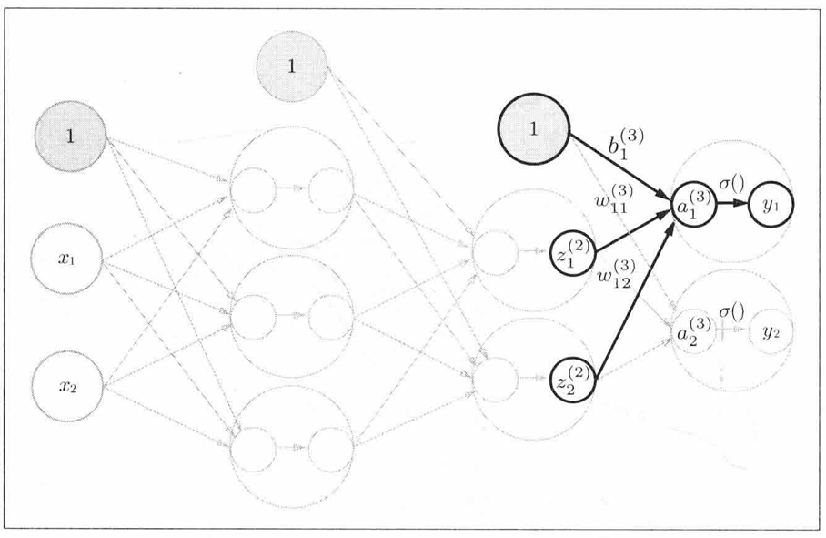

*图中的$\sigma() $表示的是输出层的激活函数*

第三层
$$
{\large A_3=Z_2W^{T}_3+B_3}
$$
其中
$$
{\large A_3=\begin{bmatrix}a_{1}^{(3)}&a_{2}^{(3)}\end{bmatrix},Z_2=\begin{bmatrix}z_{1}^{(2)}&z_{2}^{(2)}\end{bmatrix},W_3=\begin{bmatrix}w_{11}^{(3)}&w_{12}^{(3)}\\w_{21}^{(3)}&w_{22}^{(2)}\end{bmatrix},B_3=\begin{bmatrix}b_{1}^{(3)}&b_{2}^{(3)}\end{bmatrix} }
$$
代码实现

```python
W3 = np.array([[0.1, 0.2],
               [0.3, 0.4]])
B3 = np.array([0.1, 0.2])

A3 = np.dot(Z2, W3.T) + B3
Y = A3 # 输出层的这里的sigma函数为恒等函数

print(Y) # [0.30288721 0.6804023 ]
```

这就是3层神经网络的实现过程了，把代码总结一下。

```python
class Three_layers_network():
    def __init__(self):
        self.params = {}
        self.params['W1'] = np.array([[0.1, 0.2],[0.3, 0.4],[0.5, 0.6]])
        self.params['B1'] = np.array([0.1, 0.2, 0.3])
        self.params['W2'] = np.array([[0.6, 0.5, 0.4],[0.3, 0.2, 0.1]])
        self.params['B2'] = np.array([0.1, 0.2])
        self.params['W3'] = np.array([[0.1, 0.2],[0.3, 0.4]])
        self.params['B3'] = np.array([0.1, 0.2])
        
    def forward(self, X):
        W1, W2, W3 = self.params['W1'], self.params['W2'], self.params['W3']
        B1, B2, B3 = self.params['B1'], self.params['B2'], self.params['B3']
        
        A1 = np.dot(X, W1.T) + B1
        Z1 = sigmoid(A1) # 激活函数h()
        A2 = np.dot(Z1, W2.T) + B2
        Z2 = sigmoid(A2)
        A3 = np.dot(Z2, W3.T) + B3
        Y = A3 # 输出层的这里的sigma函数为恒等函数
        return Y
        
model = Three_layers_network()
X = np.array([1.0, 0.5])
Y = model.forward(X)
print(Y) # [0.30288721 0.6804023 ]
```

#### 关于输出层

神经网络可以用在**分类问题**和**回归问题**上。对于输出层的激活函数，一般而言，回归问题用恒等函数，分类问题用**Softmax函数**。
$$
\large Softmax(a_i)=\frac{e^{a_{i}}}{\sum ^{n}_{k=1}e^{a_{k}}}
$$
代码表示如下

```python
def softmax(a):
    c = np.max(a)
    exp_a = np.exp(a - c) # 指数级运算存在溢出问题
    sum_exp_a = np.sum(exp_a)
    y = exp_a / sum_exp_a
    return y
```

Softmax函数输出值的总和为1，因此我们把Softmax函数的输出解释为概率。

------

## 批处理

在刚才的三层神经网络中，输入只有$x_1$和 $x_2$两种，但实际上给模型训练时需要给模型输入大量的样本，如果每一次只输入一个（2，）的矩阵的话就不能充分的发挥矩阵运算的优势，因此我们给输入矩阵增加一个维度，一次输入多行，如（10000， 2）。这样原本10000次矩阵运算直接变成1次，非常高效地完成了运算。这种打包方式输入的数据叫做**批(batch)**。

#### 全量批处理

一次直接用全部训练数据算梯度，在数据较多的场景中更新慢。

#### 小批处理（mini-batch）

在训练的时候只从所有的数据量中随机取少量计算梯度下降和损失函数。

------

## 损失函数

损失函数表示的是当前的神经网络对监督数据不拟合程度。

#### 均方误差

表达式如下
$$
\large E=\frac{1}{2N}\sum ^N _{k}\left(y_{k}-t_{k}\right)^{2}
$$
其中$y_k​$为神经网络的输出，$t_k​$为监督数据(标签)， $k​$表示是数据的维度。

代码实现如下

```python
def mean_squared_error(y, t):
    return np.mean((y-t) ** 2) * 0.5
```

#### 交叉熵误差

表达式如下
$$
\large E=-\sum _{k}t_{k}\ln y_{k}
$$
代码实现如下

```python
def cross_entropy_error(y, t):
    delta = 1e-7 # 若y_k的输入为0会出现负无穷大，一个微小值可以防止此类情况发生
    return -np.sum(t * np.log(y + delta))
```

在分类问题中，$y_k$和$t_k$一般为如下形式

```python
y = [0.1, 0.06, 0.08, 0.06, 0.6, 0.1]
t = [0,   0,    0,    0,    1,   0  ]
```

像监督数据这种将正确解标签表示为1，其他标签表示为0的表示方法称为**独热码表示**。

```python
mean_squared_error(np.array(y), np.array(t))
# 0.09680000000000002
cross_entropy_error(np.array(y), np.array(t))
# 0.510825457099338
```

------

## 神经网络的学习

神经网络的学习就是不断地调整权重和偏置来让损失函数尽可能地小，如何让一个多元函数的结果尽可能小？答案就是**梯度(gradient)**，高等数学的知识告诉我们，在函数某点的所有的下降方向中，梯度方向下降得最多。

需要注意的是，我们无法保障梯度所指向的方向就是函数的最小值。实际上，在复杂函数中，梯度指向的方向基本上都不是函数的最小值。

 这也正是为什么神经网络的训练不会使用阶跃函数，因为不连续的阶跃函数无法得出梯度。

#### 梯度下降

在梯度法中，函数的取值从当前位置沿着梯度的方向前进一段距离，然后在新的地方重新求梯度，如此反复，不断地沿着梯度的方向前进，逐渐减小函数值的过程就是**梯度下降(gradient descent method)**。

用数学表达式来表示这一过程
$$
\large w_0 = w_0-\eta \frac{\partial f}{\partial w_0}\\\large w_1 = w_1-\eta \frac{\partial f}{\partial w_1}
$$
式中$\eta$为**学习率**。

代码实现如下

```python
def numerical_gradient(f, x): # 数值法求梯度
    h = 1e-4
    grad = np.zeros_like(x)

    for idx in range(x.size):
        tmp = x.flat[idx]

        x.flat[idx] = tmp + h
        fxh1 = f(x)

        x.flat[idx] = tmp - h
        fxh2 = f(x)

        grad.flat[idx] = (fxh1 - fxh2) / (2 * h)
        x.flat[idx] = tmp  # 还原
    return grad

def gradient_descent(f, init_w, lr=0.01, steps=100):
    w = init_w
    for i in range(steps):
        grad = numerical_gradient(f, w)
        w -= lr * grad
    return w
```

#### 学习算法的实现

我们把刚才的三层神经网络拉过来修改一下，加入**随机梯度下降法（SGD, stochastic gradient descent）**。

这里我构造了一个非线性函数的数据集来让模型去拟合。

```python
class Three_layers_network():
    def __init__(self, input_size, hidden_1_size, hidden_2_size, output_size):
        self.params = {}
        # 随机高斯分布（行，列）
        self.params['W1'] = np.random.randn(hidden_1_size, input_size) * 0.01
        self.params['B1'] = np.random.randn(hidden_1_size) * 0.01
        self.params['W2'] = np.random.randn(hidden_2_size, hidden_1_size)*0.01
        self.params['B2'] = np.random.randn(hidden_2_size) * 0.01
        self.params['W3'] = np.random.randn(output_size, hidden_2_size) * 0.01
        self.params['B3'] = np.random.randn(output_size) * 0.01

    def predict(self, X):
        W1, W2, W3 = self.params['W1'], self.params['W2'], self.params['W3']
        B1, B2, B3 = self.params['B1'], self.params['B2'], self.params['B3']

        A1 = np.dot(X, W1.T) + B1
        Z1 = sigmoid(A1)  # 激活函数h()
        A2 = np.dot(Z1, W2.T) + B2
        Z2 = sigmoid(A2)
        A3 = np.dot(Z2, W3.T) + B3
        Y = A3  # 拟合函数属于回归问题，使用恒等函数
        return Y

    def loss(self, x, t):  # x:输入数据，t:监督数据
        y = self.predict(x)

        return mean_squared_error(y, t)

    def gradients(self, x, t):
        loss_W = lambda W: self.loss(x, t)
		
        grads = {}
        grads['W1'] = numerical_gradient(loss_W, self.params['W1'])
        grads['B1'] = numerical_gradient(loss_W, self.params['B1'])
        grads['W2'] = numerical_gradient(loss_W, self.params['W2'])
        grads['B2'] = numerical_gradient(loss_W, self.params['B2'])
        grads['W3'] = numerical_gradient(loss_W, self.params['W3'])
        grads['B3'] = numerical_gradient(loss_W, self.params['B3'])
        
        return grads

num_sample = 60000

# 构造数据集
x = np.random.rand(num_sample, 3) * 10
noise = np.random.rand(num_sample) * 0.5
t = np.sin(x[:, 0]) + (x[:, 1] ** 2) * 0.1 + x[:, 2] + noise
t = t[:, np.newaxis]

model = Three_layers_network(3, 6, 6, 1)

epochs = 20000
batch_size = 200
learning_rate = 0.1

for epoch in range(epochs):
    # 全量批处理，直接把60000条数据投入更新速度会很慢，只有在数据量小的时候才会使用。
    #grads = model.gradients(x, t)
    
    # 所以选择mini-batch实现
    idx = np.random.choice(num_sample, batch_size)
    x_batch, t_batch = x[idx], t[idx]
    
    grads = model.gradients(x_batch, t_batch)
    for key in ('W1', 'B1', 'W2', 'B2', 'W3', 'B3'):
        model.params[key] -= learning_rate * grads[key]
        
    if epoch % 50 == 0:
    	print(f"Epoch {epoch}, Loss={model.loss(x, t):.4f}")
```

 这就是一个神经网络完整的学习过程了！

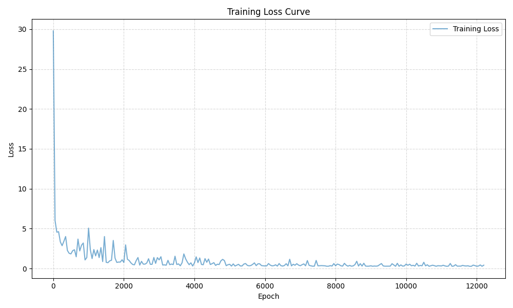

------

## 误差反向传播

在上面的求梯度计算中使用的方法是数值微分，数值微分简单易实现，但是在实际的训练过程中计算是十分费时间的，而使用下面的误差反向传播法则可以高速地计算梯度。

所谓反向传播，就是顺着链式法则一路反向乘回去，得出每一层权重和偏置的梯度方向。

#### ReLU层

$$
\large y=\begin{cases}0&\left(x \leq0 \right)\\x&\left(x>0 \right)\end{cases}
$$

求偏导
$$
\large \frac{\partial L}{\partial x} =\begin{cases}0&\left(x \leq0 \right)\\\frac{\partial L}{\partial y} &\left(x>0 \right)\end{cases}
$$
代码如下

```python
class ReLU:
    def __init__(self):
        self.mask = None
        
    def forward(self, x):
        self.mask = (x <=0) # mask是由True/False构成的NumPy数组
        out = x.copy()
        out[self.mask] = 0
        return out
    
    def backward(self, dout):
        dout[self.mask] = 0
        dx = dout
        return dx
```

#### Sigmoid层

$$
\large y=\frac{1}{1+e^{-x}}
$$

求偏导
$$
\large \frac{\partial L}{\partial x} =\frac{\partial L}{\partial y}y^2e^{-x}=\frac{\partial L}{\partial y}y(1-y)
$$
代码如下

```python
class Sigmoid:
    def __init__(self):
        self.out = None
        
    def forward(self, x):
        out = 1 / (1 + np.exp(-x))
        self.out = out
        return out
    
    def backward(self, dout):
        dx = dout * (1.0 - self.out) * self.out
        return dx
```

#### Affine层

$$
{\large Y=X W^{T}+B}
$$

求偏导
$$
\large \frac{\partial L}{\partial X} =\large \frac{\partial L}{\partial Y} W\\ 
\large \frac{\partial L}{\partial W} =(\frac{\partial L}{\partial Y})^TX\\
\large \frac{\partial L}{\partial B} =\large \frac{\partial L}{\partial Y}
$$
代码如下

```python
class Affine:
    def __init__(self, W, B):
        self.W = W
        self.B = B
        self.x = None
        self.dW = None
        self.dB = None
        
    def forward(self, x):
        self.x = x
        out = np.dot(x, self.W.T) + self.B
        return out
    
    def backward(self, dout):
        dx = np.dot(dout, self.W)
        self.dW = np.dot(dout.T, self.x)
        self.dB = np.sum(dout, axis=0)
        return dx
```

#### Softmax-with-Loss 层和 Identity-with-MSE 层

即Softmax函数与交叉熵误差和恒等函数和均方差。

求偏导的结果是
$$
\large \frac{\partial L}{\partial X} =\large \frac{\partial L}{\partial Y} (Y-T)
$$
其中$T$是监督数据。两个复杂的函数复合后求偏导的结果非常漂亮，这不是偶然，而是为了这样的结果特意设计的交叉熵函数。在回归问题中恒等函数的损失函数选择均方误差也是出于同样的理由。

代码如下

```python
class SoftmaxWithLoss:
    def __init__(self):
        self.loss = None
        self.y = None
        self.t = None
        
    def forward(self, x, t):
        self.t = t
        self.y = softmax(x)
        self.loss = cross_entropy_error(self.y, self.t)
        return self.loss
    
    def backward(self, dout=1): # 反向传播的起点
        batch_size = self.t.shape[0]
        dx = (self.y - self.t) / batch_size
        return dx
```

```python
class IdentityWithMSE:
    def __init__(self):
        self.loss = None
        self.y = None
        self.t = None

    def forward(self, x, t):
        self.t = t
        self.y = x  # 恒等函数
        self.loss = mean_squared_error(self.y, self.t)
        return self.loss
    
    def backward(self, dout=1):
        batch_size = self.t.shape[0]
        dx = (self.y - self.t) / batch_size
        return dx
```

#### 神经网络的最终实现

```python
from collections import OrderedDict

class Three_layers_network():
    def __init__(self, input_size, hidden_1_size, hidden_2_size, output_size):
        self.params = {}
        # 随机高斯分布（行，列）He初始值加快初始学习速度
        self.params['W1'] = np.random.randn(hidden_1_size, input_size) * np.sqrt(2 / input_size)
        self.params['B1'] = np.random.randn(hidden_1_size) * 0.1
        self.params['W2'] = np.random.randn(hidden_2_size, hidden_1_size)\
         					* np.sqrt(2 / hidden_1_size)
        self.params['B2'] = np.random.randn(hidden_2_size) * 0.1
        self.params['W3'] = np.random.randn(output_size, hidden_2_size)\
        					* np.sqrt(2 / hidden_2_size)
        self.params['B3'] = np.random.randn(output_size)  * 0.1
		
        # 构建层
        self.layers = OrderedDict() # 有序字典
        self.layers['Affine_1'] = Affine(self.params['W1'], self.params['B1'])
        self.layers['ReLU_1'] = ReLU()
        self.layers['Affine_2'] = Affine(self.params['W2'], self.params['B2'])
        self.layers['ReLU_2'] = ReLU()
        self.layers['Affine_3'] = Affine(self.params['W3'], self.params['B3'])
        
        self.last_layer = IdentityWithMSE()
        
    def predict(self, X):
        for layer in self.layers.values():
            X = layer.forward(X)
        return X

    def loss(self, x, t):  # x:输入数据，t:监督数据
        y = self.predict(x)
        return self.last_layer.forward(y, t) # 恒等函数和均方差

    def gradients(self, x, t, lr=0.01):
        # 前向传播
        self.loss(x, t)
        # 反向传播
        dout = self.last_layer.backward()
        back_layers = list(self.layers.values())
        back_layers.reverse()
        
        for layer in back_layers:
            dout = layer.backward(dout)
        
        grads = {}
        grads['W1'] = self.layers['Affine_1'].dW
        grads['B1'] = self.layers['Affine_1'].dB
        grads['W2'] = self.layers['Affine_2'].dW
        grads['B2'] = self.layers['Affine_2'].dB
        grads['W3'] = self.layers['Affine_3'].dW
        grads['B3'] = self.layers['Affine_3'].dB
        
        return grads

num_sample = 60000

# 构造数据集
x = np.random.rand(num_sample, 3) * 10
noise = np.random.rand(num_sample) * 0.5
t = np.sin(x[:, 0]) + (x[:, 1] ** 2) * 0.1 + x[:, 2] + noise
t = t[:, np.newaxis]

model = Three_layers_network(3, 6, 6, 1)

epochs = 20000
batch_size = 200
learning_rate = 0.01

for epoch in range(epochs):
    # 全量批处理，直接把60000条数据投入更新速度会很慢，只有在数据量小的时候才会使用。
    #grads = model.gradients(x, t)
    
    # 所以选择mini-batch实现
    idx = np.random.choice(num_sample, batch_size)
    x_batch, t_batch = x[idx], t[idx]
    
    grads = model.gradients(x_batch, t_batch)
    for key in ('W1', 'B1', 'W2', 'B2', 'W3', 'B3'):
        model.params[key] -= learning_rate * grads[key]
        
    if epoch % 50 == 0:
    	print(f"Epoch {epoch}, Loss={model.loss(x, t):.4f}")
```

------

## 与学习相关的技巧

#### SDG

之前我们一直使用的是随机梯度下降法（SDG）。

```python
class SGD:
    def __init__(self, lr=0.01):
        self.lr = lr
        
    def update(self, params, grads):
        for key in params.keys():
            params[key] -= self.lr * grads[key] 
```

但是还有很多算法能够提升神经网络的学习效率，这些算法被叫做**优化器（optimizer）**。优化器的任务就是把梯度转换成下一次的参数更新。

#### Momentum

$$
\large v \leftarrow \alpha v - \eta \frac{\partial L}{\partial W}\\
\large W\leftarrow W+v
$$

不同于随机梯度下降法，这种方法和物理有关，给人的感觉就像小球在地面上滚动。$\alpha$对应着摩擦力或空气阻力。

```python
class Momentum:
    def __init__(self, lr=0.01, momentum=0.9):
        self.lr = lr
        self.momentum = momentum
        self.v = None
        
    def update(self, params, grads):
        if self.v is None:
            self.v = {}
            for key, val in params.items():                                
                self.v[key] = np.zeros_like(val)
                
        for key in params.keys():
            self.v[key] = self.momentum*self.v[key] - self.lr*grads[key] 
            params[key] += self.v[key]
```

#### AdaGrad

$$
\large h \leftarrow h+ \frac{\partial L}{\partial W} \odot  \frac{\partial L}{\partial W}\\
\large W \leftarrow W-\eta  \frac{1}{\sqrt {h}} \frac{\partial L}{\partial W}
$$

AdaGrad会为参数的每个元素适当的调整学习率。$h$是之前所有梯度值的平方和，$\odot$表示对应矩阵元素的乘法。

```python
class AdaGrad:
    def __init__(self, lr=0.01):
        self.lr = lr
        self.h = None
        
    def update(self, params, grads):
        if self.h is None:
            self.h = {}
            for key, val in params.items():
                self.h[key] = np.zeros_like(val)
            
        for key in params.keys():
            self.h[key] += grads[key] * grads[key]
            params[key] -= self.lr * grads[key] / (np.sqrt(self.h[key]) + 1e-7)
```

#### Adam

将Momentum和AdaGrad两种方法融合在一起就是Adam方法的基本思路。有望实现参数空间的高效搜索。

```python
class Adam:
    def __init__(self, lr=0.001, beta1=0.9, beta2=0.999):
        self.lr = lr
        self.beta1 = beta1
        self.beta2 = beta2
        self.iter = 0
        self.m = None
        self.v = None
        
    def update(self, params, grads):
        if self.m is None:
            self.m, self.v = {}, {}
            for key, val in params.items():
                self.m[key] = np.zeros_like(val)
                self.v[key] = np.zeros_like(val)
        
        self.iter += 1
        lr_t  = self.lr * np.sqrt(1.0 - self.beta2**self.iter) / (1.0 - self.beta1**self.iter)         
        
        for key in params.keys():
            #self.m[key] = self.beta1*self.m[key] + (1-self.beta1)*grads[key]
            #self.v[key] = self.beta2*self.v[key] + (1-self.beta2)*(grads[key]**2)
            self.m[key] += (1 - self.beta1) * (grads[key] - self.m[key])
            self.v[key] += (1 - self.beta2) * (grads[key]**2 - self.v[key])
            
            params[key] -= lr_t * self.m[key] / (np.sqrt(self.v[key]) + 1e-7)
            
            #unbias_m += (1 - self.beta1) * (grads[key] - self.m[key]) # correct bias
            #unbisa_b += (1 - self.beta2) * (grads[key]*grads[key] - self.v[key]) # correct bias
            #params[key] += self.lr * unbias_m / (np.sqrt(unbisa_b) + 1e-7)
```

#### Batch Normalization

调整各层激活值的分布使其拥有适当的广度，可以令学习快速的进行，并且不那么依赖初始值。

具体而言就是使数据分布的均值为0，方差为1的正规化。

```python
class BatchNormalization:
    def __init__(self, gamma, beta, momentum=0.9, running_mean=None, running_var=None):
        self.gamma = gamma
        self.beta = beta
        self.momentum = momentum
        self.input_shape = None # Conv层的情况下为4维，全连接层的情况下为2维  

        # 测试时使用的平均值和方差
        self.running_mean = running_mean
        self.running_var = running_var  
        
        # backward时使用的中间数据
        self.batch_size = None
        self.xc = None
        self.std = None
        self.dgamma = None
        self.dbeta = None

    def forward(self, x, train_flg=True):
        self.input_shape = x.shape
        if x.ndim != 2:
            N, C, H, W = x.shape
            x = x.reshape(N, -1)

        out = self.__forward(x, train_flg)
        
        return out.reshape(*self.input_shape)
            
    def __forward(self, x, train_flg):
        if self.running_mean is None:
            N, D = x.shape
            self.running_mean = np.zeros(D)
            self.running_var = np.zeros(D)
                        
        if train_flg:
            mu = x.mean(axis=0)
            xc = x - mu
            var = np.mean(xc**2, axis=0)
            std = np.sqrt(var + 10e-7)
            xn = xc / std
            
            self.batch_size = x.shape[0]
            self.xc = xc
            self.xn = xn
            self.std = std
            self.running_mean = self.momentum * self.running_mean + (1-self.momentum) * mu
            self.running_var = self.momentum * self.running_var + (1-self.momentum) * var            
        else:
            xc = x - self.running_mean
            xn = xc / ((np.sqrt(self.running_var + 10e-7)))
            
        out = self.gamma * xn + self.beta 
        return out

    def backward(self, dout):
        if dout.ndim != 2:
            N, C, H, W = dout.shape
            dout = dout.reshape(N, -1)

        dx = self.__backward(dout)

        dx = dx.reshape(*self.input_shape)
        return dx

    def __backward(self, dout):
        dbeta = dout.sum(axis=0)
        dgamma = np.sum(self.xn * dout, axis=0)
        dxn = self.gamma * dout
        dxc = dxn / self.std
        dstd = -np.sum((dxn * self.xc) / (self.std * self.std), axis=0)
        dvar = 0.5 * dstd / self.std
        dxc += (2.0 / self.batch_size) * self.xc * dvar
        dmu = np.sum(dxc, axis=0)
        dx = dxc - dmu / self.batch_size
        
        self.dgamma = dgamma
        self.dbeta = dbeta
        
        return dx
```

#### 权值衰减

很多拟合是因为权值过大发生的，该方法可以在学习的过程中对大的权重进行惩罚，抑制过拟合。例如给损失函数加上权重的平方范数（L2范数）$\sqrt{w^2_1+w^2_2+w^2_3+...+w^2_n}$,权值衰减为$\frac{1}{2} \lambda W^2$。

#### Dropout

在学习过程中随机删除神经元的方法。从而每一次都让不同的模型来学习，并且在推理时，通过对神经元的输出乘删除比例可以取得模型的平均值，将类似集成学习的效果通过一个神经网络实现了。

```python
class Dropout:
    def __init__(self, dropout_ratio=0.5):
        self.dropout_ratio = dropout_ratio
        self.mask = None

    def forward(self, x, train_flg=True):
        if train_flg:
            self.mask = np.random.rand(*x.shape) > self.dropout_ratio
            return x * self.mask
        else:
            return x * (1.0 - self.dropout_ratio)

    def backward(self, dout):
        return dout * self.mask
```


------

## 卷积神经网络（Convolutional Neural Network，CNN）

CNN相对神经网络新出现了卷积层（Convolution层）和池化层（Pooling层）。

对于图像输入，全连接层不能提取其中的形状，而卷积层会以三维的数据形式接受并传给下一层。

如下图，对于一个图像输入（4，4），有（3，3）大小的**滤波器（核）**来与之运算。

卷积运算会以一定的间隔滑动滤波器的窗口，将各个位置对应的元素和滤波器上的元素相乘，然后再求和，将结构保存到输出的对应位置。

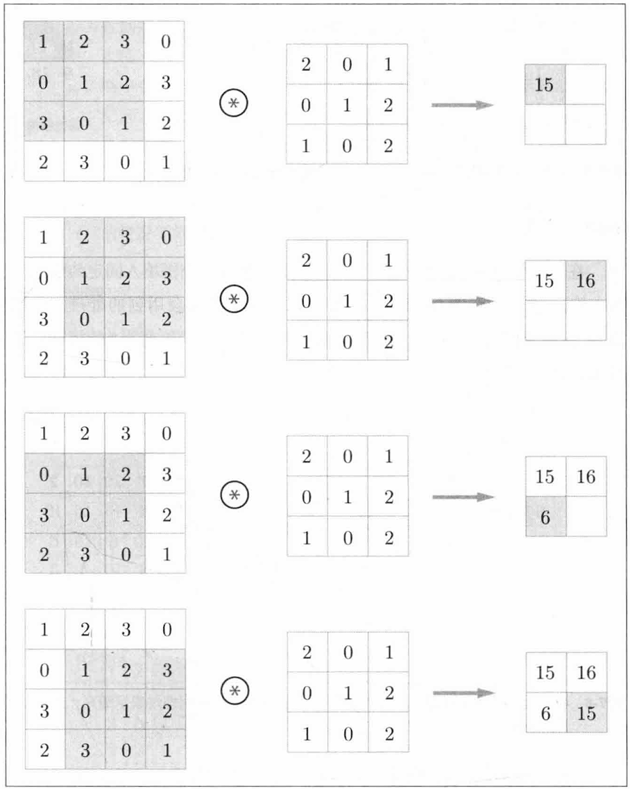

CNN中，滤波器就对应全连接层中的权重。 CNN也存在偏置，偏置通常只有一个（1，1），这个值被加到了输出结果的所有元素上。

#### 填充（padding）

在处理之前，有时会向输入数据周围填入固定数据，比如0。这就是**填充**。如图，对（4，4）应用了幅度为1的填充，就是用0来1填充周围。

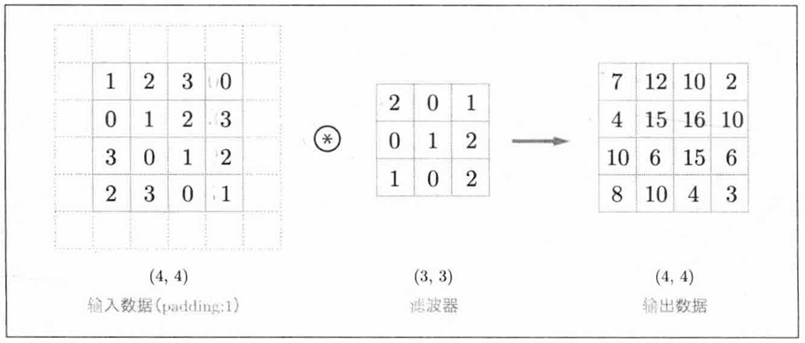

 这样做可以调整输出的大小。

#### 步幅（stride）

移动滤波器的位置间隔被称为步幅，如图是步幅为2的运算过程。

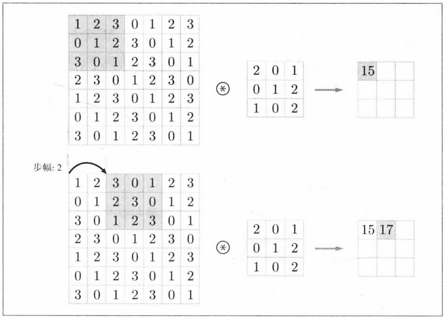

#### 三维卷积运算

如图是三通道的卷积运算。

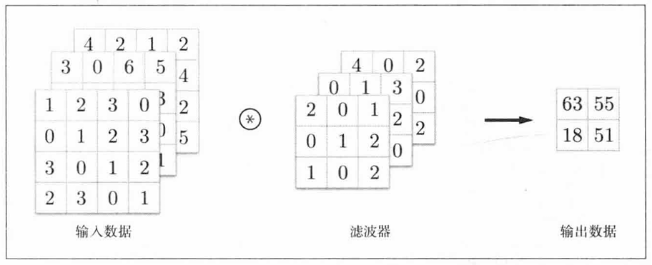

三维的输入可以表示为$(channel, height, width)$，即$(C, H, W)$。滤波器也一样，$(channel, filter, height)$，即$(C, FH, FW)$。

实际处理中不只用到一个滤波器，就像全连接层的权重不止有一个。

#### 批处理

各层间传递的数据可以保存为四维形式，$(batch\_size, channel, height, width)$，如图。

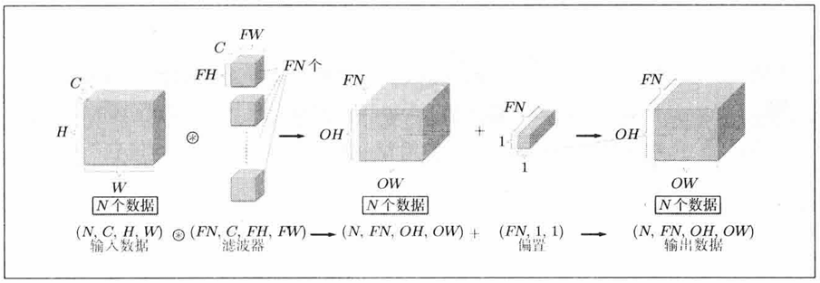

#### 池化层

就是压缩，如图是Max池化。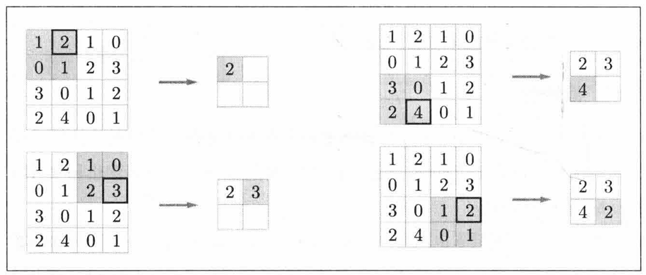

#### 卷积层和池化层的实现

四维直接实现的话比较复杂，这里可以借助im2col函数。im2col函数会将应用滤波器的三维方块展开成一行，汇总成一个大矩阵来运算，之后将滤波器展开成列，计算两个矩阵的乘积即可，最后将结果转化合适的形状即可。

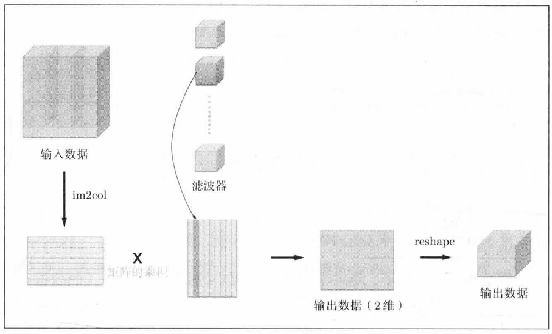

```python
def im2col(input_data, filter_h, filter_w, stride=1, padding=0):
    """
    Parameters
    ----------
    input_data : 由(数据量, 通道, 高, 长)的4维数组构成的输入数据
    filter_h : 滤波器的高
    filter_w : 滤波器的长
    stride : 步幅
    padding : 填充

    Returns
    -------
    col : 2维数组
    """
    N, C, H, W = input_data.shape
    out_h = (H + 2*padding - filter_h)//stride + 1
    out_w = (W + 2*padding - filter_w)//stride + 1

    img = np.pad(input_data, [(0,0), (0,0), (padding, padding), (padding, padding)], 'constant')
    col = np.zeros((N, C, filter_h, filter_w, out_h, out_w))

    for y in range(filter_h):
        y_max = y + stride*out_h
        for x in range(filter_w):
            x_max = x + stride*out_w
            col[:, :, y, x, :, :] = img[:, :, y:y_max:stride, x:x_max:stride]

    col = col.transpose(0, 4, 5, 1, 2, 3).reshape(N*out_h*out_w, -1)
    return col
```

有来就有回

```python
def col2im(col, input_shape, filter_h, filter_w, stride=1, padding=0):
    """
    Parameters
    ----------
    col :
    input_shape : 输入数据的形状（例：(10, 1, 28, 28)）
    filter_h :
    filter_w
    stride
    pad

    Returns
    -------
    """
    N, C, H, W = input_shape
    out_h = (H + 2*padding - filter_h)//stride + 1
    out_w = (W + 2*padding - filter_w)//stride + 1
    col = col.reshape(N, out_h, out_w, C, filter_h, filter_w).transpose(0, 3, 4, 5, 1, 2)

    img = np.zeros((N, C, H + 2*padding + stride - 1, W + 2*padding + stride - 1))
    for y in range(filter_h):
        y_max = y + stride*out_h
        for x in range(filter_w):
            x_max = x + stride*out_w
            img[:, :, y:y_max:stride, x:x_max:stride] += col[:, :, y, x, :, :]

    return img[:, :, padding:H + padding, padding:W + padding]
```

卷积层的实现

```python
class Convolution:
    def __init__(self, W, B, stride=1, padding=0):
        self.W = W
        self.B = B
        self.stride = stride
        self.padding = padding
        
        # 中间数据（backward时使用）
        self.x = None   
        self.col = None
        self.col_W = None
        
        # 权重和偏置参数的梯度
        self.dW = None
        self.dB = None
        
    def forward(self, x):
        FN, C, FH, FW = self.W.shape
        N, C, H, W = x.shape
        out_h = int(1 + (H + 2*self.padding - FH) / self.stride)
        out_w = int(1 + (W + 2*self.padding - FW) / self.stride)
        
        col = im2col(x, FH, FW, self.stride, self.padding)
        col_W = self.W.reshape(FN, -1).T # 滤波器的展开
        
        out = np.dot(col, col_W) + self.B
        out = out.reshape(N, out_h, out_w, -1).transpose(0, 3, 1, 2)
        
        self.x = x
        self.col = col
        self.col_W = col_W
        return out
        
    def backward(self, dout):
        FN, C, FH, FW = self.W.shape
        dout = dout.transpose(0,2,3,1).reshape(-1, FN)

        self.dB = np.sum(dout, axis=0)
        self.dW = np.dot(self.col.T, dout)
        self.dW = self.dW.transpose(1, 0).reshape(FN, C, FH, FW)

        dcol = np.dot(dout, self.col_W.T)
        dx = col2im(dcol, self.x.shape, FH, FW, self.stride, self.padding)

        return dx
```

池化层也类似，使用im2col展开。

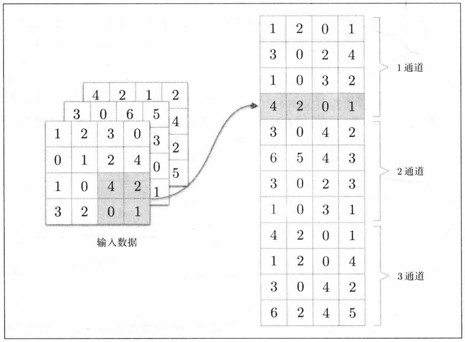

池化层的实现

```python
class Pooling:
    def __init__(self, pool_h, pool_w, stride=1, padding=0):
        self.pool_h = pool_h
        self.pool_w = pool_w
        self.stride = stride
        self.padding = padding
        
        self.x = None
        self.arg_max = None
        
    def forward(self, x):
        N, C, H, W = x.shape
        out_h = int(1 + (H - self.pool_h) / self.stride)
        out_w = int(1 + (W - self.pool_w) / self.stride)
        # 展开
        col = im2col(x, self.pool_h, self.pool_w, self.stride, self.padding)
        col = col.reshape(-1, self.pool_h * self.pool_w)
        # 最大值
        arg_max = np.argmax(col, axis=1)
        out = np.max(col, axis=1)
        # 转换
        out = out.reshape(N, out_h, out_w, C).transpose(0, 3, 1, 2)
        
        self.x = x
        self.arg_max = arg_max
        return out
    
    def backward(self, dout):
        dout = dout.transpose(0, 2, 3, 1)
        
        pool_size = self.pool_h * self.pool_w
        dmax = np.zeros((dout.size, pool_size))
        dmax[np.arange(self.arg_max.size), self.arg_max.flatten()] = dout.flatten()
        dmax = dmax.reshape(dout.shape + (pool_size,)) 
        
        dcol = dmax.reshape(dmax.shape[0] * dmax.shape[1] * dmax.shape[2], -1)
        dx = col2im(dcol, self.x.shape, self.pool_h, self.pool_w, self.stride, self.padding)
        
        return dx
```

#### 注意事项

为了适池化层传来的四维数据，全连接层应当能够自动展平多维度输入。

```python
class Affine:
    def __init__(self, W, B):
        self.W =W
        self.B = B
        
        self.x = None
        self.original_x_shape = None
        # 权重和偏置参数的导数
        self.dW = None
        self.dB = None

    def forward(self, x):
        # 对应张量
        self.original_x_shape = x.shape
        x = x.reshape(x.shape[0], -1)
        self.x = x

        out = np.dot(x, self.W.T) + self.B

        return out

    def backward(self, dout):
        dx = np.dot(dout, self.W)
        self.dW = np.dot(dout.T, self.x)
        self.dB = np.sum(dout, axis=0)
        
        dx = dx.reshape(*self.original_x_shape)  # 还原输入数据的形状（对应张量）
        return dx
```

softmax处理多维批量数据应该把同一批次的不同样本分开求和。

```python
def softmax(x):
    if x.ndim == 2:
        x = x.T
        x = x - np.max(x, axis=0)
        y = np.exp(x) / np.sum(np.exp(x), axis=0)
        return y.T 

    x = x - np.max(x) # 溢出对策
    return np.exp(x) / np.sum(np.exp(x))
```

交叉熵函数在给定独热码监督数据时也应该能够转换为正确的标签。

```python
def cross_entropy_error(y, t):
    if y.ndim == 1:
        t = t.reshape(1, t.size)
        y = y.reshape(1, y.size)
        
    # 监督数据是one-hot-vector的情况下，转换为正确解标签的索引
    if t.size == y.size:
        t = t.argmax(axis=1)
             
    batch_size = y.shape[0]
    return -np.sum(np.log(y[np.arange(batch_size), t] + 1e-7)) / batch_size
```

```python
class SoftmaxWithLoss:
    def __init__(self):
        self.loss = None
        self.y = None # softmax的输出
        self.t = None # 监督数据

    def forward(self, x, t):
        self.t = t
        self.y = softmax(x)
        self.loss = cross_entropy_error(self.y, self.t)
        
        return self.loss

    def backward(self, dout=1):
        batch_size = self.t.shape[0]
        if self.t.size == self.y.size: # 监督数据是one-hot-vector的情况
            dx = (self.y - self.t) / batch_size
        else:
            dx = self.y.copy()
            dx[np.arange(batch_size), self.t] -= 1
            dx = dx / batch_size
        
        return dx
```

#### 手写数字识别

整个卷积网络的实现如下，用它来学习MNIST数据集实现手写数字识别。

它的层次结构是$Conv - ReLU - Rool - Affine - ReLU - Affine - Softmax$

```python
class SimpleConvNet:
    """简单的ConvNet   
    Parameters
    ----------
    input_size : 输入大小（MNIST的情况下为784）
    hidden_size_list : 隐藏层的神经元数量的列表（e.g. [100, 100, 100]）
    output_size : 输出大小（MNIST的情况下为10）
    activation : 'relu' or 'sigmoid'
    weight_init_std : 指定权重的标准差（e.g. 0.01）
        指定'relu'或'he'的情况下设定“He的初始值”
        指定'sigmoid'或'xavier'的情况下设定“Xavier的初始值”
    """
    def __init__(self, input_dim=(1, 28, 28), 
                 conv_param={'filter_num':30, 'filter_size':5, 'padding':0, 'stride':1},
                 hidden_size=100, output_size=10, weight_init_std=0.01):
        filter_num = conv_param['filter_num']
        filter_size = conv_param['filter_size']
        filter_padding = conv_param['padding']
        filter_stride = conv_param['stride']
        input_size = input_dim[1]
        conv_output_size = (input_size - filter_size + 2*filter_padding) / filter_stride + 1
        pool_output_size = int(filter_num * (conv_output_size/2) * (conv_output_size/2))

        # 初始化权重
        self.params = {}
        self.params['W1'] = weight_init_std * \
                            np.random.randn(filter_num, input_dim[0], filter_size, filter_size)
        self.params['B1'] = np.zeros(filter_num)
        self.params['W2'] = weight_init_std * \
                            np.random.randn(pool_output_size, hidden_size)
        self.params['B2'] = np.zeros(hidden_size)
        self.params['W3'] = weight_init_std * \
                            np.random.randn(hidden_size, output_size)
        self.params['B3'] = np.zeros(output_size)

        # 生成层
        self.layers = OrderedDict()
        self.layers['Conv1'] = Convolution(self.params['W1'], self.params['B1'],
                                           conv_param['stride'], conv_param['padding'])
        self.layers['Relu1'] = ReLU()
        self.layers['Pool1'] = Pooling(pool_h=2, pool_w=2, stride=2)
        self.layers['Affine1'] = Affine(self.params['W2'], self.params['B2'])
        self.layers['Relu2'] = ReLU()
        self.layers['Affine2'] = Affine(self.params['W3'], self.params['B3'])

        self.last_layer = SoftmaxWithLoss()

    def predict(self, x):
        for layer in self.layers.values():
            x = layer.forward(x)

        return x

    def loss(self, x, t):
        y = self.predict(x)
        return self.last_layer.forward(y, t)
	
    # 新增识别率函数
    def accuracy(self, x, t, batch_size=100):
        if t.ndim != 1 : t = np.argmax(t, axis=1)
        
        acc = 0.0
        
        for i in range(int(x.shape[0] / batch_size)):
            tx = x[i*batch_size:(i+1)*batch_size]
            tt = t[i*batch_size:(i+1)*batch_size]
            y = self.predict(tx)
            y = np.argmax(y, axis=1)
            acc += np.sum(y == tt) 
        
        return acc / x.shape[0]

    def gradient(self, x, t):
        # forward
        self.loss(x, t)

        # backward
        dout = 1
        dout = self.last_layer.backward(dout)

        layers = list(self.layers.values())
        layers.reverse()
        for layer in layers:
            dout = layer.backward(dout)

        # 设定
        grads = {}
        grads['W1'], grads['B1'] = self.layers['Conv1'].dW, self.layers['Conv1'].dB
        grads['W2'], grads['B2'] = self.layers['Affine1'].dW, self.layers['Affine1'].dB
        grads['W3'], grads['B3'] = self.layers['Affine2'].dW, self.layers['Affine2'].dB

        return grads
        
    def save_params(self, file_name="params.pkl"):
        params = {}
        for key, val in self.params.items():
            params[key] = val
        with open(file_name, 'wb') as f:
            pickle.dump(params, f)

    def load_params(self, file_name="params.pkl"):
        with open(file_name, 'rb') as f:
            params = pickle.load(f)
        for key, val in params.items():
            self.params[key] = val

        for i, key in enumerate(['Conv1', 'Affine1', 'Affine2']):
            self.layers[key].W = self.params['W' + str(i+1)]
            self.layers[key].B = self.params['B' + str(i+1)]
```

训练的过程打包成一个类

```python
class Trainer:
    """进行神经网络的训练的类"""
    def __init__(self, network, x_train, t_train, x_test, t_test,
                 epochs=20, mini_batch_size=100,
                 optimizer='SGD', optimizer_param={'lr':0.01}):
        self.network = network
        self.x_train = x_train
        self.t_train = t_train
        self.x_test = x_test
        self.t_test = t_test
        self.epochs = epochs
        self.batch_size = mini_batch_size

        # optimzer
        # 之前介绍过的有sdg、momentum、adagrad、adam
        optimizer_class_dict = {'sgd':SGD, 'momentum':Momentum, 'nesterov':Nesterov,
                                'adagrad':AdaGrad, 'rmsprpo':RMSprop, 'adam':Adam}
        # 转换成小写选中指定的优化器类并传入参数实例化
        self.optimizer = optimizer_class_dict[optimizer.lower()](**optimizer_param)
        
        self.train_size = x_train.shape[0]
        self.iter_per_epoch = max(self.train_size / mini_batch_size, 1)
        self.max_iter = int(epochs * self.iter_per_epoch)
        self.current_iter = 0
        self.current_epoch = 0
        
        self.train_loss_list = []
        self.train_acc_list = []
        self.test_acc_list = []

    def train_step(self):
        batch_mask = np.random.choice(self.train_size, self.batch_size)
        x_batch = self.x_train[batch_mask]
        t_batch = self.t_train[batch_mask]
        
        # 计算梯度并更新
        grads = self.network.gradient(x_batch, t_batch)
        self.optimizer.update(self.network.params, grads)
        
        # 记录损失
        loss = self.network.loss(x_batch, t_batch)
        self.train_loss_list.append(loss)
        print("train loss:" + str(loss))
        
        if self.current_iter % self.iter_per_epoch == 0:
            self.current_epoch += 1
                
            train_acc = self.network.accuracy(self.x_train, self.t_train)
            test_acc = self.network.accuracy(self.x_test, self.t_test)
            self.train_acc_list.append(train_acc)
            self.test_acc_list.append(test_acc)

            print(f"=== epoch: {self.current_epoch}, train acc: {train_acc:.4f}, test acc: {test_acc:.4f} ===")
            
        self.current_iter += 1

    def train(self):
        for i in range(self.max_iter):
            self.train_step()

        test_acc = self.network.accuracy(self.x_test, self.t_test)

        print("=============== Final Test Accuracy ===============")
        print(f"test acc: {test_acc:.4}")
        
```

读取MNIST数据集。

```python
import os
import gzip
import pickle
import numpy as np
import urllib.request

def load_mnist(normalize=True, flatten=True, one_hot=False):
    """简化版MNIST数据加载器"""
    url = 'http://yann.lecun.com/exdb/mnist/'
    files = {
        'train_img': 'train-images-idx3-ubyte.gz',
        'train_lbl': 'train-labels-idx1-ubyte.gz',
        'test_img': 't10k-images-idx3-ubyte.gz',
        'test_lbl': 't10k-labels-idx1-ubyte.gz'
    }
    
    # 缓存文件路径
    cache = os.path.join(os.path.dirname(__file__), 'mnist.pkl')
    
    # 如果缓存存在直接加载
    if os.path.exists(cache):
        with open(cache, 'rb') as f:
            data = pickle.load(f)
    else:
        # 下载并转换数据
        data = {}
        for k, v in files.items():
            path = os.path.join(os.path.dirname(__file__), v)
            if not os.path.exists(path):
                urllib.request.urlretrieve(url + v, path)
            
            with gzip.open(path, 'rb') as f:
                if 'img' in k:
                    data[k] = np.frombuffer(f.read(), np.uint8, offset=16)
                else:
                    data[k] = np.frombuffer(f.read(), np.uint8, offset=8)
        
        # 保存缓存
        with open(cache, 'wb') as f:
            pickle.dump(data, f)
    
    # 预处理
    x_train = data['train_img'].reshape(-1, 784).astype(float)
    x_test = data['test_img'].reshape(-1, 784).astype(float)
    y_train = data['train_lbl']
    y_test = data['test_lbl']
    
    if normalize:
        x_train /= 255.0
        x_test /= 255.0
    
    if not flatten:
        x_train = x_train.reshape(-1, 1, 28, 28)
        x_test = x_test.reshape(-1, 1, 28, 28)
    
    if one_hot:
        def one_hot_encode(labels):
            mat = np.zeros((len(labels), 10))
            mat[np.arange(len(labels)), labels] = 1
            return mat
        y_train = one_hot_encode(y_train)
        y_test = one_hot_encode(y_test)
    
    return (x_train, y_train), (x_test, y_test)
```

开始正式训练

```python
(x_train, t_train), (x_test, t_test) = load_mnist(flatten=False)

max_epochs = 20

network = SimpleConvNet(input_dim=(1,28,28), 
                        conv_param = {'filter_num': 30, 'filter_size': 5, 'padding': 0,'stride': 1},
                        hidden_size=100, output_size=10, weight_init_std=0.01)
                        
trainer = Trainer(network, x_train, t_train, x_test, t_test,
                  epochs=max_epochs, mini_batch_size=100,
                  optimizer='Adam', optimizer_param={'lr': 0.001})
trainer.train()
```

这就是一个结构简单的卷积神经网络学习的所有过程了，代码看着比较复杂，但实际上的结构和前面的神经网络是一回事。

这个神经网络的识别率可以达到98~99%，性能非常不错，更复杂结构的卷积神经网络也容易实现，比如下面这种结构的，识别率可以超过99%，在SimpleConvNet的基础上修改即可，此处不做演示。

```
conv - relu - conv- relu - pool -
conv - relu - conv- relu - pool -
conv - relu - conv- relu - pool -
affine - relu - dropout - affine - dropout - softmax
```

------

## 结语

文章图片和内容大部分来自[《深度学习入门：基于Python的理论和实现》[日] 斋藤康毅](https://www.ituring.com.cn/book/1921)。

感谢你阅读这篇文章！如果你有任何问题或建议，欢迎通过 [GitHub Issues](https://github.com/Ling-Nine/Ling-nine.github.io/issues) 与我交流。

---

*本文使用 Markdown 编写，最后更新于 2026年7月30日*